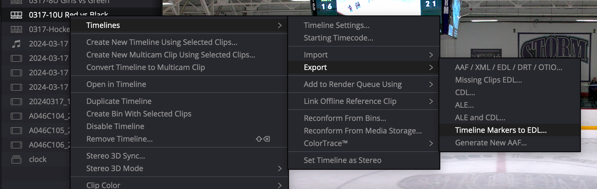

Simple script that will parse Davinci Resolve exported marker files and convert them to a format for Youtube's chapters.

Install by setting up the [Go programming language](https://go.dev/) on your system. Then install it via:

```
go install github.com/mgb/daviniciToYoutube@latest
```

To export the markers to the EDL format, ensure your timeline is the active one in the Edit window. Then right click the timeline in your Media Pool and select `Timelines -> Export -> Timeline Markers to EDL`.



Now in a terminal, you can execute:
```
daviniciToYoutube my-timeline.edl
```

That will output in the terminal what you can copy/paste directly into a Youtube description for chapter markers. It also writes the same output to `my-timeline.txt` so you can reference that later.